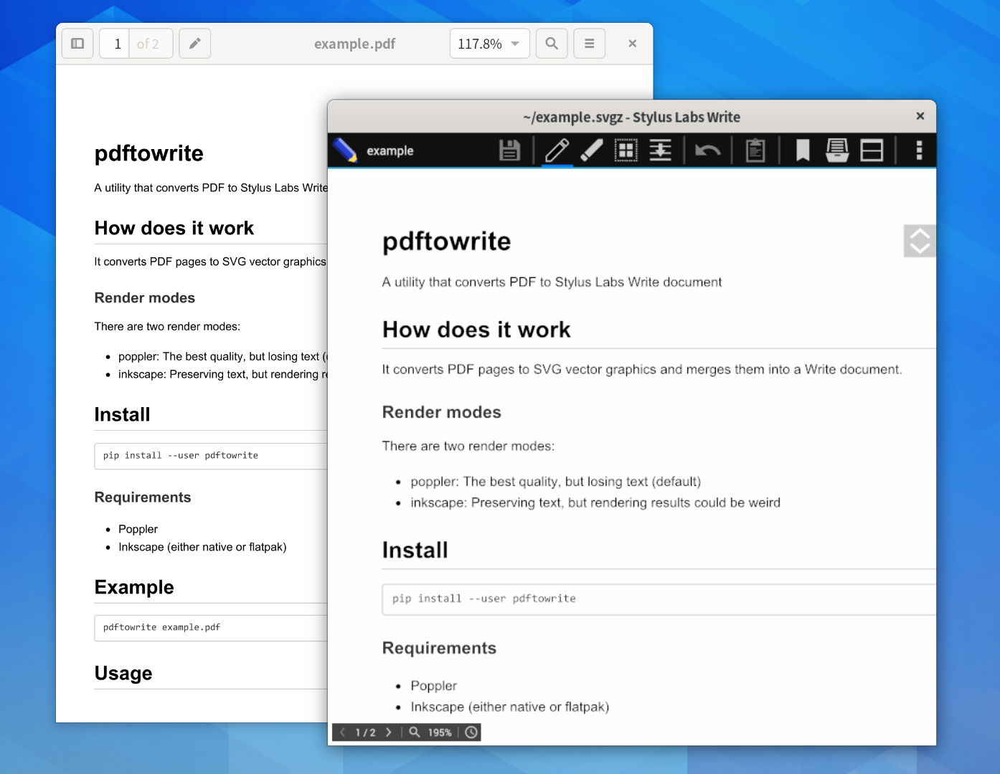

# pdftowrite



A utility that converts PDF to Stylus Labs Write document

## How does it work

It converts PDF pages to SVG vector graphics and merges them into a Write
document.

### Render modes

There are two render modes:

 * poppler: The best quality, but losing text (default)
 * inkscape: Preserving text, but rendering results could be weird

## Install

```
pip install --user pdftowrite
```

### Requirements

 * Poppler
 * Inkscape (either native or flatpak)

## Example

```
pdftowrite example.pdf
```

## Usage

```
usage: pdftowrite [-h] [-v] [-o OUTPUT] [-m {poppler,inkscape}] [-d DPI]
                  [-g PAGES] [-u NODUP_PAGES] [-Z] [-s SCALE] [-x X] [-y Y]
                  [-X XRULING] [-Y YRULING] [-l MARGIN_LEFT] [-p PAPERCOLOR]
                  [-r RULECOLOR]
                  FILE

Convert PDF to Stylus Labs Write document

positional arguments:
  FILE                  A pdf file

optional arguments:
  -h, --help            show this help message and exit
  -v, --version         show program's version number and exit
  -o OUTPUT, --output OUTPUT
                        Specify output filename
  -m {poppler,inkscape}, --mode {poppler,inkscape}
                        Specify render mode (default: poppler)
  -d DPI, --dpi DPI     Specify resolution for bitmaps and rasterized filters
                        (default: 96)
  -g PAGES, --pages PAGES
                        Specify pages to convert (e.g. "1 2 3", "1-3")
                        (default: all)
  -u NODUP_PAGES, --nodup-pages NODUP_PAGES
                        Specify no-dup pages (e.g. "1 2 3", "1-3") (default:
                        all)
  -Z, --nozip           Do not compress output
  -s SCALE, --scale SCALE
                        Scale page size (default: 1.0)
  -x X                  Specify the x coordinate of the viewport of <svg>
                        (default: 10.0)
  -y Y                  Specify the y coordinate of the viewport of <svg>
                        (default: 10.0)
  -X XRULING, --xruling XRULING
                        Specify x rulling (default: 0.0)
  -Y YRULING, --yruling YRULING
                        Specify y rulling (default: 40.0)
  -l MARGIN_LEFT, --margin-left MARGIN_LEFT
                        Specify margin left (default: 100.0)
  -p PAPERCOLOR, --papercolor PAPERCOLOR
                        Specify paper color (default: #FFFFFF)
  -r RULECOLOR, --rulecolor RULECOLOR
                        Specify rule color (default: #9F0000FF)
```

